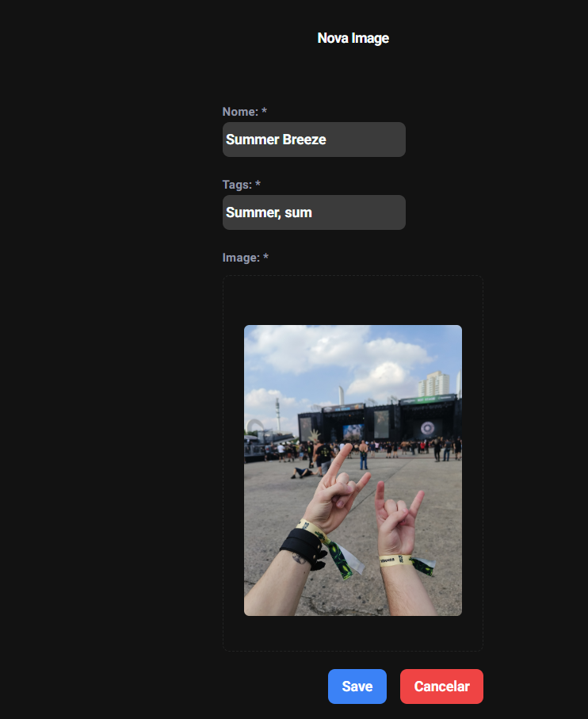
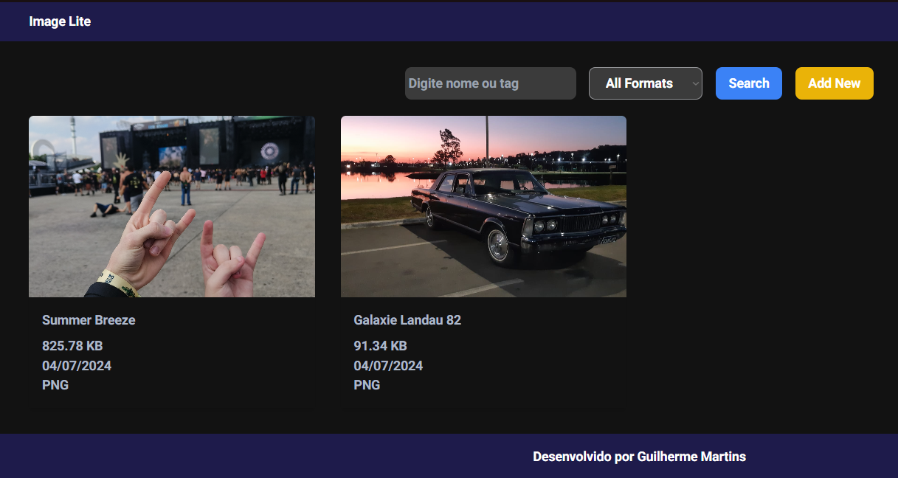

# Projeto-React-Java

Tabela de conteúdos
=================

    <a href="#sobre">Sobre</a> •
    <a href="#como-usar">Como usar</a> • 
    <a href="#pre-requisitos">Pré-requisitos</a> • 
    <a href="#exemplo">Exemplos</a> • 

Este projeto consiste em uma aplicação full-stack com back-end desenvolvido em Java, front-end desenvolvido em React.JS e banco de dados PostgreSQL

    Basta baixar do repositório e executar o arquivo start.sh, por exemplo em um terminal bash basta executar: "bash start.sh"

    ### Docker instalado

    <h1 align="center">
    
    </h1>
    <h1 align="center">
    
    </h1>

